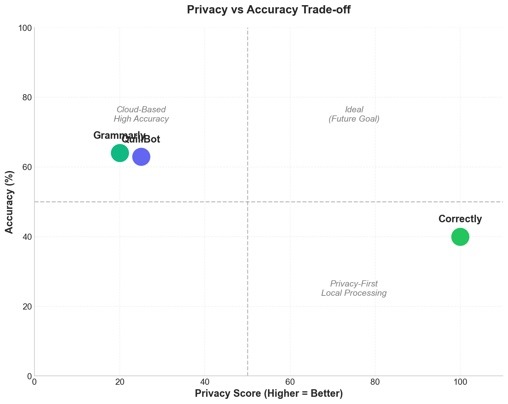
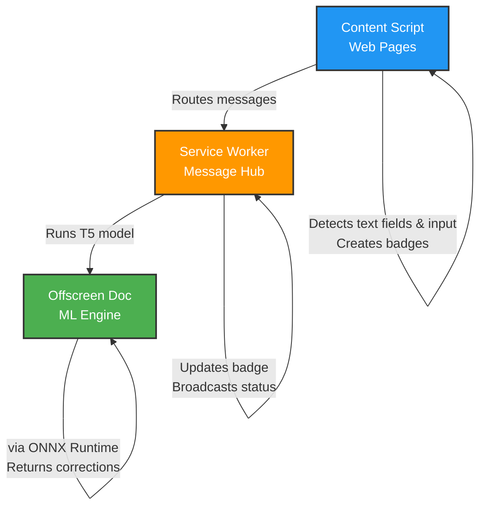
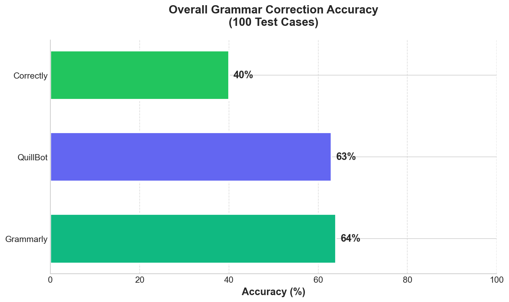
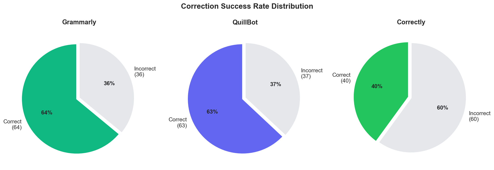
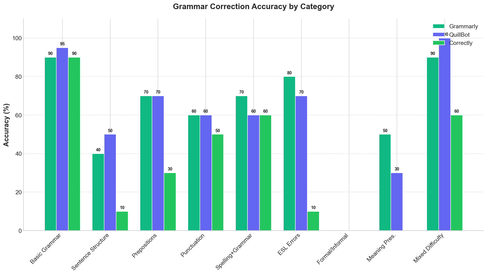
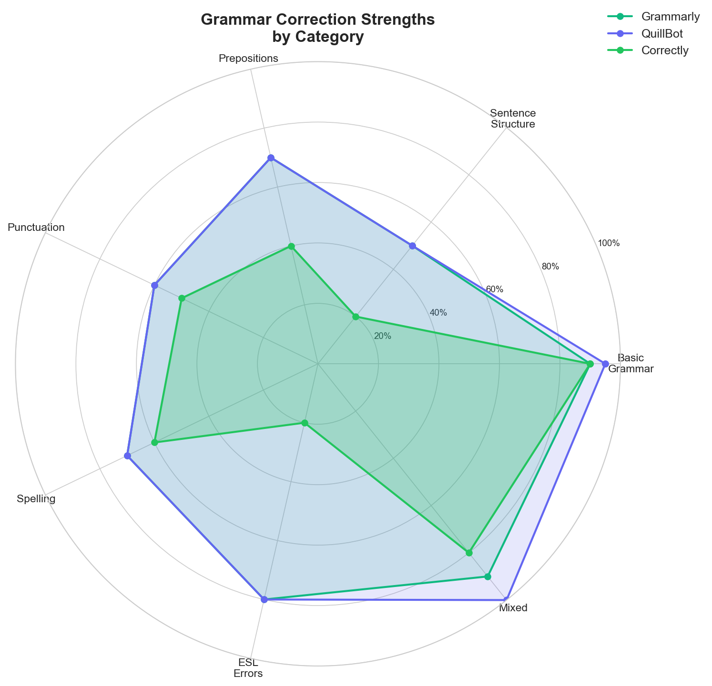
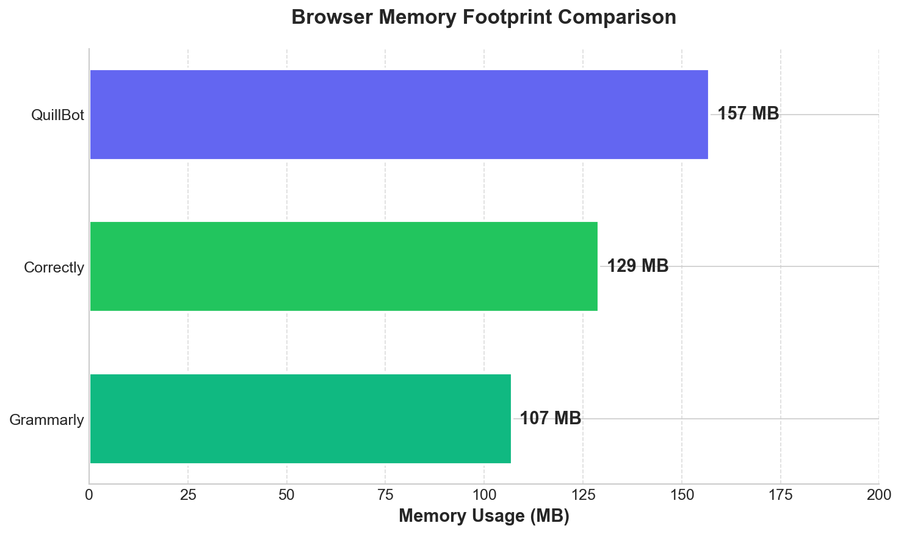
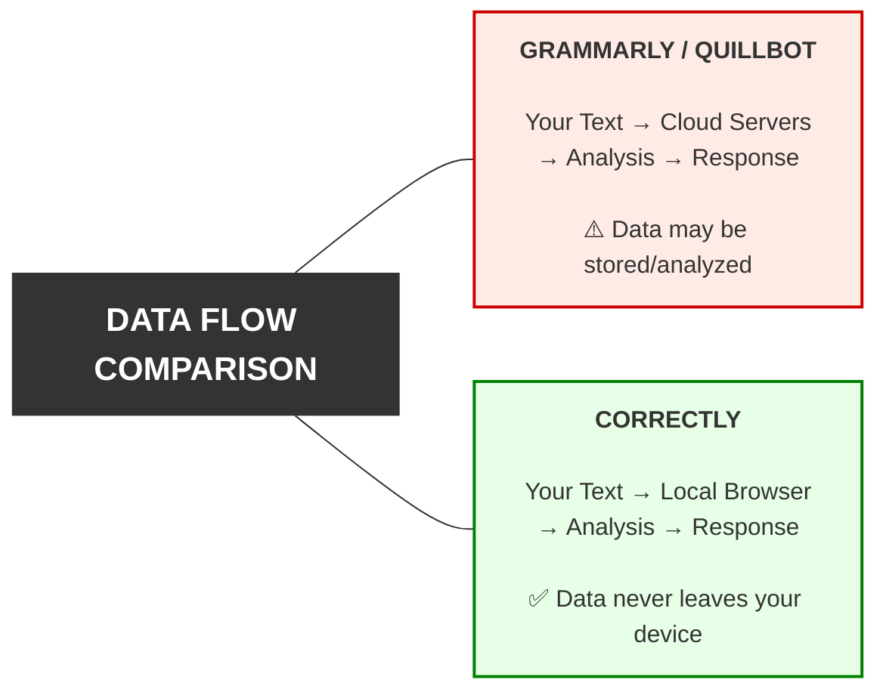

<p align="center">
  
</p>

<h1 align="center">Correctly</h1>

<p align="center">
  <strong>Free, Open-Source, Privacy-First Grammar Correction</strong>
</p>

<p align="center">
  <a href="#features">Features</a> •
  <a href="#how-it-works">How It Works</a> •
  <a href="#benchmarks">Benchmarks</a> •
  <a href="#installation">Installation</a> •
  <a href="#tech-stack">Tech Stack</a>
</p>

<p align="center">
  
  
  
  
</p>

---

## Why Correctly?

Grammar tools shouldn't cost money, collect your data, or hide their code. **Correctly** is built on three principles:

- **Free Forever** — No subscriptions, no premium tiers, no paywalls
- **Open Source** — Full transparency, community-driven development
- **Privacy-First** — Runs entirely in your browser, your text never leaves your device

<p align="center">
  
</p>

| Feature | Grammarly | QuillBot | Correctly |
|---------|:---------:|:--------:|:---------:|
| Price | Subscription | Subscription | **Free** |
| Open Source | No | No | **Yes** |
| Privacy | Cloud-based | Cloud-based | **100% Local** |
| Data Collection | Yes | Yes | **None** |
| Works Offline | No | No | **Yes** |

---

## Features

- **Real-time Grammar Checking** — Automatically detects errors as you type in any text field
- **Smart Visual Badges** — Color-coded indicators show correction status at a glance
- **Word-by-Word Suggestions** — Review and apply changes individually or all at once
- **Universal Compatibility** — Works on `<input>`, `<textarea>`, and contenteditable elements
- **Zero Configuration** — Install and start writing better immediately
- **Completely Offline** — No internet required after initial model download

---

## How It Works



### The Magic Behind the Badge

1. **Type** in any text field on any website
2. **Wait** 1.5 seconds (debounced to avoid excessive processing)
3. **Click** the badge that appears in the corner of the field
4. **Review** word-by-word diff with highlighted changes
5. **Apply** corrections with Skip / Next / Apply All buttons

---

## Benchmarks

We tested Correctly against industry leaders using a comprehensive benchmark of **100 grammar test cases** across 10 categories.

### Overall Accuracy Comparison

<p align="center">
  
</p>

### Success Rate Distribution

<p align="center">
  
</p>

### Category-by-Category Breakdown

<p align="center">
  
</p>

### Strengths Radar

<p align="center">
  
</p>

### Detailed Performance Table

| Category | Grammarly | QuillBot | Correctly | Test Cases |
|----------|:---------:|:--------:|:---------:|:----------:|
| Basic Grammar Errors | 90% | **95%** | 90% | 20 |
| Sentence Structure | **50%** | **50%** | 10% | 10 |
| Prepositions & Conjunctions | **70%** | **70%** | 30% | 10 |
| Punctuation & Capitalization | 60% | 60% | **50%** | 10 |
| Spelling & Grammar Combined | **70%** | **70%** | 60% | 10 |
| ESL-Style Errors | **80%** | **80%** | 10% | 10 |
| Formal vs Informal | 0% | 0% | 0% | 10 |
| Meaning Preservation | **50%** | 30% | 30% | 10 |
| Mixed Difficulty | 90% | **100%** | 60% | 10 |
| **Overall** | **64%** | **63%** | 40% | 100 |

### Memory Usage Comparison

<p align="center">
  
</p>

| Tool | RAM Usage | Processing Location |
|------|:---------:|---------------------|
| Grammarly | **107 MB** | Cloud servers |
| Correctly | 129 MB | **Local browser** |
| QuillBot | 157 MB | Cloud servers |

---

## Key Insights

> **Correctly trades some accuracy for complete privacy.** While cloud services achieve ~64% accuracy by processing text on powerful servers, Correctly achieves 40% running entirely in your browser — and your data never leaves your device.

### Where Correctly Excels
- **Basic Grammar** (90%) — Subject-verb agreement, tense consistency
- **Punctuation** (50%) — Capitalization, commas, periods
- **Spelling Errors** (60%) — Typos and common misspellings

### Where Cloud Services Lead
- **ESL-Style Errors** — Idiomatic expressions, preposition usage
- **Complex Restructuring** — Word order, passive voice conversion
- **Contextual Understanding** — Meaning preservation in complex sentences

---

## Installation

### From Source

```bash
# Clone the repository
git clone https://github.com/yourusername/correctly.git
cd correctly/correctly

# Install dependencies (downloads Transformers.js)
npm install

# Load in Chrome
# 1. Go to chrome://extensions/
# 2. Enable "Developer mode"
# 3. Click "Load unpacked"
# 4. Select the 'correctly' folder
```

### Directory Structure

```
correctly/
├── correctly/              # Extension source
│   ├── manifest.json       # Chrome extension config
│   ├── src/
│   │   ├── background.js   # Service worker
│   │   ├── content.js      # Content script (850 lines)
│   │   └── offscreen.js    # ML inference handler
│   ├── pages/
│   │   └── offscreen.html  # Offscreen document
│   ├── lib/                # Pre-bundled libraries
│   │   ├── transformers.min.js
│   │   └── ort-wasm-*.wasm # ONNX Runtime WASM
│   └── icons/              # Extension icons
└── metrics/                # Benchmarking suite
    ├── code/               # Python analysis scripts
    ├── data/               # Benchmark results (JSON)
    └── charts/             # Generated visualizations
```

---

## Tech Stack

| Layer | Technology |
|-------|------------|
| **Extension** | Chrome Manifest V3 |
| **Frontend** | Vanilla JavaScript, CSS3 Animations |
| **ML Framework** | [Transformers.js](https://github.com/xenova/transformers.js) v2.17.2 |
| **Model** | T5-base Grammar Correction (Hugging Face) |
| **Inference** | ONNX Runtime WebAssembly |
| **Benchmarking** | Python 3, Matplotlib, NumPy |

---

## How the Model Works

Correctly uses a **T5 (Text-to-Text Transfer Transformer)** model fine-tuned for grammar correction:

```
Input:  "He go to the office every day."
         ↓
    [T5 Encoder-Decoder]
         ↓
Output: "He goes to the office every day."
```

The model runs via **ONNX Runtime** compiled to WebAssembly, enabling near-native performance in the browser without any server communication.

---

## Benchmark Methodology

Our benchmarks use 100 carefully curated test cases across 10 categories:

| Category | Test Cases | Description |
|----------|:----------:|-------------|
| Basic Grammar Errors | 20 | Subject-verb agreement, tense |
| Sentence Structure | 10 | Word order, passive voice |
| Prepositions & Conjunctions | 10 | Common preposition mistakes |
| Punctuation & Capitalization | 10 | Commas, capitals, periods |
| Spelling & Grammar Combined | 10 | Homophones, typos with grammar |
| ESL-Style Errors | 10 | Common non-native patterns |
| Formal vs Informal | 10 | Tone appropriateness |
| Meaning Preservation | 10 | Double negatives, nuance |
| Mixed Difficulty | 10 | Real-world mixed errors |

### Regenerating Charts

```bash
cd metrics

# First time setup
python3 -m venv venv
./venv/bin/pip install matplotlib numpy

# Generate charts
./venv/bin/python code/generate_charts.py
```

---

## Privacy Guarantee



---

## Roadmap

- [ ] Custom model fine-tuning for higher accuracy
- [ ] Support for multiple languages
- [ ] Writing style suggestions
- [ ] Firefox extension port
- [ ] Keyboard shortcuts
- [ ] Dark mode support

---

## Contributing

Contributions are welcome! Please feel free to submit a Pull Request. For major changes, please open an issue first to discuss what you would like to change.

### Areas for Contribution
- Model fine-tuning for better accuracy
- UI/UX improvements
- Additional language support
- Performance optimizations

---

## License

MIT License - see [LICENSE](LICENSE) for details.

---

<p align="center">
  <sub>Free. Open Source. Private. Your words stay yours.</sub>
</p>

<p align="center">
  <a href="#correctly">Back to Top</a>
</p>
